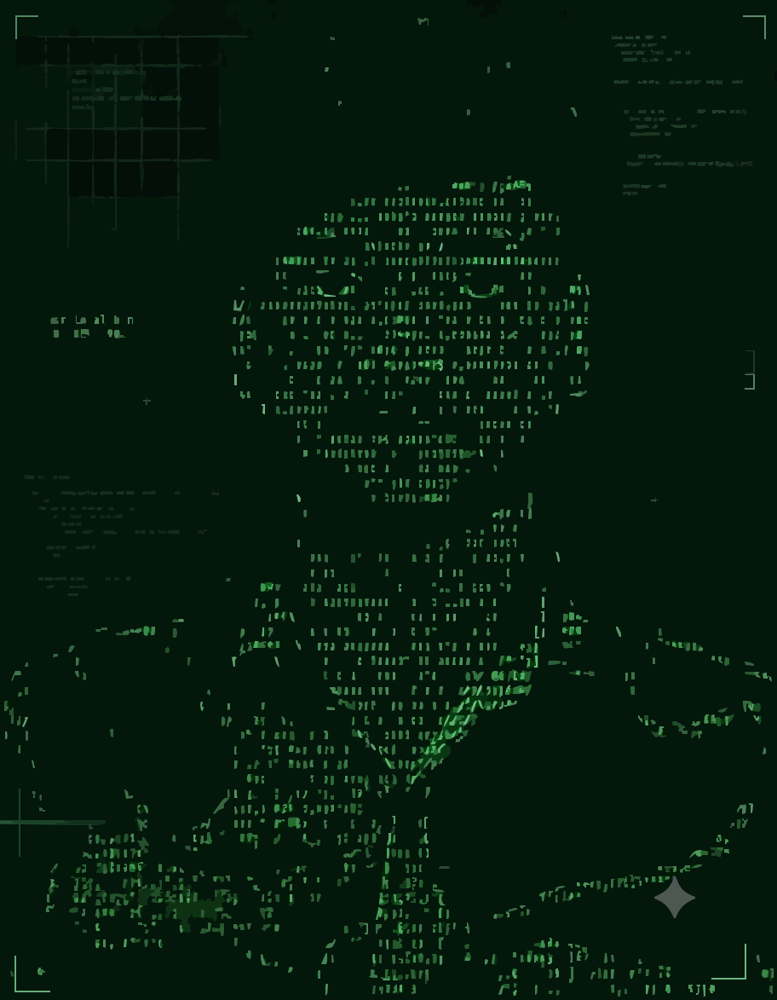

# 👋 Hi, I'm Sumit Kumar

<div align="center">

### `sumit@github:~$ whoami`

**Software Engineer • AI/ML Developer • Full Stack Developer**

Building practical software, AI-powered applications, and modern web experiences.

<br>

[](https://github.com/Sumitkumar136)
[](https://www.linkedin.com/)
[](https://sumitkumar-dev.vercel.app/)

</div>

---

<div align="center">



</div>

---

## 🧑‍💻 About Me

I'm an **MCA AI/ML student and developer** focused on building practical software solutions across **backend development, full-stack applications, and artificial intelligence**.

I enjoy turning ideas into working products — from AI-powered platforms and RAG systems to modern web applications and data-driven tools.

* 🎓 MCA — AI/ML
* 💻 Software Engineering • Backend • Full Stack
* 🤖 AI/ML • RAG • Machine Learning
* 🚀 Interested in scalable and production-ready applications
* 📚 Currently improving DSA, backend, cloud and AI/ML skills
* 🌍 Open to software engineering and AI/ML opportunities

---

## 🛠️ Tech Stack

### Languages

`C++` `Python` `Java` `JavaScript` `TypeScript` `SQL` `PHP`

### Frontend

`React` `HTML` `CSS` `Tailwind CSS` `Vite`

### Backend

`FastAPI` `Node.js` `PHP` `REST APIs` `SQLite` `MySQL`

### AI / Machine Learning

`Machine Learning` `RAG` `FAISS` `Sentence Transformers` `Gemini` `TensorFlow.js`

### Tools & Platforms

`Git` `GitHub` `VS Code` `Docker` `Streamlit` `Vercel`

---

## 🚀 Featured Projects

### 🧠 ResumeIQ

**AI-Powered Resume Intelligence & ATS Job Matching Platform**

A full-stack AI application that analyzes resumes, evaluates ATS compatibility, identifies skill gaps, and matches candidates with job requirements.

**Tech:** React • TypeScript • Tailwind CSS • FastAPI • SQLite • FAISS • Sentence Transformers • Gemini

---

### 🎮 Game-Based Learning AI/ML RAG

**AI-Powered Game-Based Learning Platform**

A learning platform combining game mechanics with AI, machine learning and RAG to create interactive topic-based learning experiences.

**Tech:** React • FastAPI • SQLite • FAISS • Sentence Transformers • Gemini/Groq

---

### 🌍 AirQualityAR

**Interactive Air Quality Visualization Platform**

A web-based platform for exploring air-quality information through interactive maps, charts and visual experiences.

**Tech:** HTML • CSS • JavaScript • Tailwind CSS • TensorFlow.js • Leaflet • Chart.js • WAQI

---

### 🔄 SwapZone

**Barter-Based Product Exchange Platform**

A platform that allows users to exchange products instead of directly purchasing them, with authentication, product listings, chat and notifications.

**Tech:** PHP • HTML • CSS • MySQL • XAMPP • PHPMailer

---

### 📊 Varun Beverages Dashboard

**Data Analysis & Machine Learning Dashboard**

An interactive Streamlit dashboard for analyzing company data and comparing machine-learning models.

**Tech:** Python • Streamlit • Pandas • Scikit-learn • Data Visualization

---

### 🔐 Face Authentication

**Computer Vision Based Face Verification System**

A face authentication system using computer vision to verify authorized users and identify unauthorized access.

**Tech:** Python • OpenCV • face_recognition

---

## 🏆 Achievements

* 🥇 **IBM Day Technovate 4.0 — 1st Prize**
* 🥇 **IBM ML Innovation Challenge — First Prize**
* 🏆 **ASP.NET / C# — First Prize**
* 🏅 **AirQualityAR — Top 5**
* 📜 **Oracle Cloud Infrastructure — AI Foundations**
* 📜 **Oracle Cloud Infrastructure — Generative AI Professional**
* 📜 **HackerRank — SQL Advanced**
* 📜 **Infosys — Data Science**

---

## 📊 GitHub Activity

<div align="center">


</div>

---

## 🧑‍💻 Developer Terminal

<div align="center">



</div>

---

## 🎯 Current Focus

```text
Software Engineering
        ↓
Backend Development
        ↓
AI / Machine Learning
        ↓
RAG & Generative AI
        ↓
Cloud & Scalable Applications
        ↓
DSA & Problem Solving
```

---

## 📈 What I'm Building

```text
[ AI ]
  ├── Resume Intelligence
  ├── RAG Applications
  └── Machine Learning

[ BACKEND ]
  ├── FastAPI
  ├── REST APIs
  └── Databases

[ FULL STACK ]
  ├── React
  ├── TypeScript
  └── Tailwind CSS

[ ENGINEERING ]
  ├── DSA
  ├── System Thinking
  └── Production-ready Applications
```

---

## 💡 My Development Philosophy

> Build it.
> Understand it.
> Improve it.
> Ship it.

I believe the best way to learn software engineering is by **building real projects, solving real problems, and continuously improving the implementation.**

---

## 🤝 Let's Connect

I'm always interested in:

* 💼 Software Engineering opportunities
* 🤖 AI/ML projects
* 🚀 Full-stack development
* ☁️ Cloud technologies
* 🤝 Open-source collaboration
* 💡 Interesting technical ideas

<div align="center">

### `sumit@github:~$ echo "Thanks for visiting!"`

**⭐ Explore my repositories and feel free to connect.**

<br>


</div>
