# 👋 Hi, I'm Sumit Kumar

### `sumit@github:~$ whoami`

**Software Engineer | AI/ML Developer | Full Stack Developer**

---

## 🧑‍💻 About Me

I'm a passionate developer interested in building practical software,
AI/ML applications, and modern web experiences.

- 🎓 MCA — AI/ML
- 💻 Interested in Software Engineering, Backend & AI/ML
- 🚀 Building real-world projects with modern technologies
- 📚 Currently improving my DSA, Backend, Cloud & AI/ML skills

---

## 🛠️ Tech Stack

### Languages
`C++` `Python` `Java` `JavaScript` `TypeScript` `SQL`

### Frontend
`React` `HTML` `CSS` `Tailwind CSS`

### Backend
`FastAPI` `Node.js` `PHP`

### AI / ML
`Machine Learning` `RAG` `FAISS` `Sentence Transformers` `Gemini`

### Tools
`Git` `GitHub` `VS Code` `Docker`

---

## 🚀 Featured Projects

### 🧠 ResumeIQ
AI-powered Resume Intelligence & ATS Job Matching Platform.

### 🎮 Game-Based Learning AI/ML RAG
AI-powered game-based learning platform using RAG and machine learning.

### 🌍 AirQualityAR
Interactive air-quality visualization platform using maps, charts and AI/ML technologies.

### 🔄 SwapZone
Barter-based product exchange platform with authentication, chat and notifications.

---

## 🏆 Achievements

- 🥇 IBM Day Technovate 4.0 — 1st Prize
- 🥇 IBM ML Innovation Challenge — First Prize
- 🏆 ASP.NET / C# — First Prize
- 🏅 AirQualityAR — Top 5

---

## 📊 GitHub Activity

---

### `sumit@github:~$ echo "Thanks for visiting!"`

⭐ If you like my projects, consider giving them a star!

